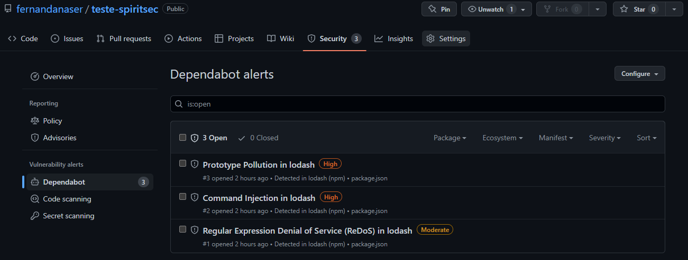

# Teste técnico SPIRITSEC

## Proposta: 

Através do Github Actions, criar uma pipeline CI/CD em que, toda vez que um código for submetido na branch “Master”, o Dependabot seja executado e gere alertas.

### Fluxo de trabalho: Git Flow
Arquivo de fluxo de trabalho (workflow):
    ```dependabot.yml```
na pasta
    ```.github/workflows```

No arquivo ```dependabot.yml``` está o evento que disparará a pipeline CI/CD.

